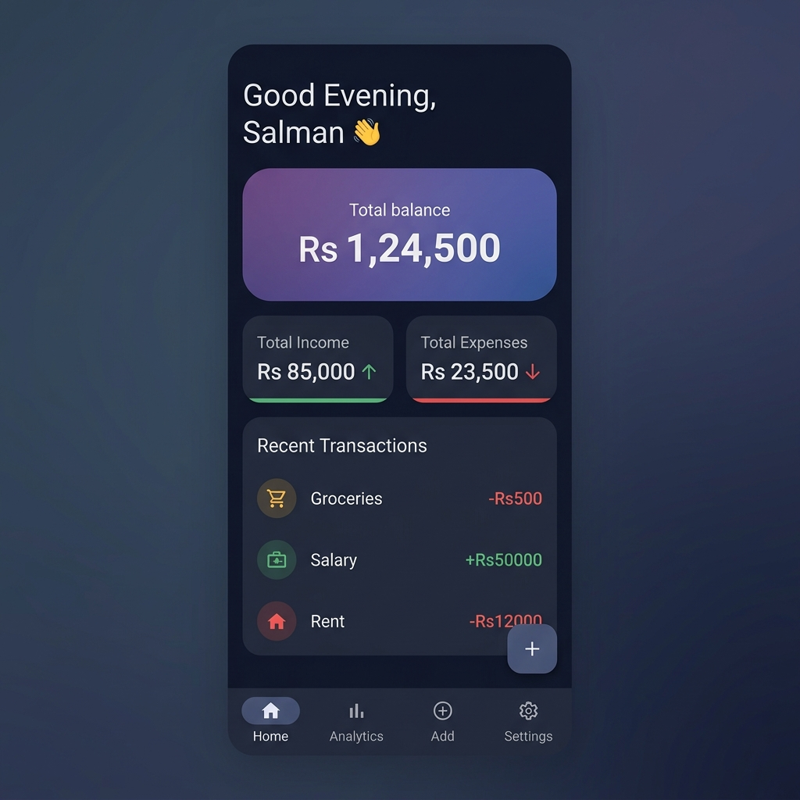
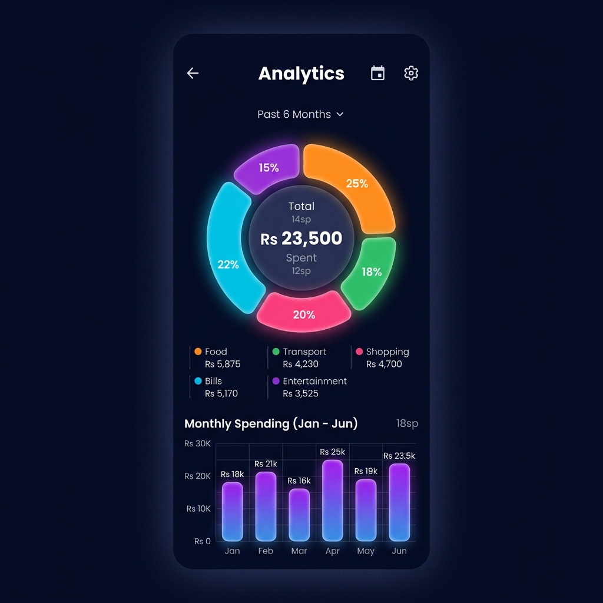
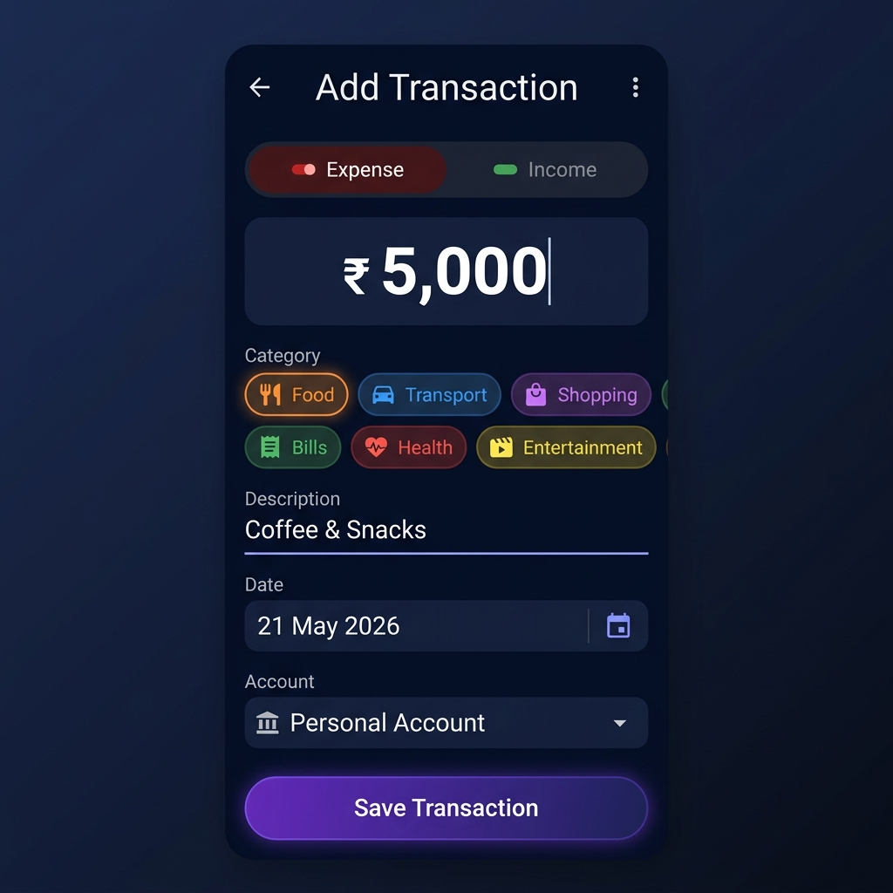
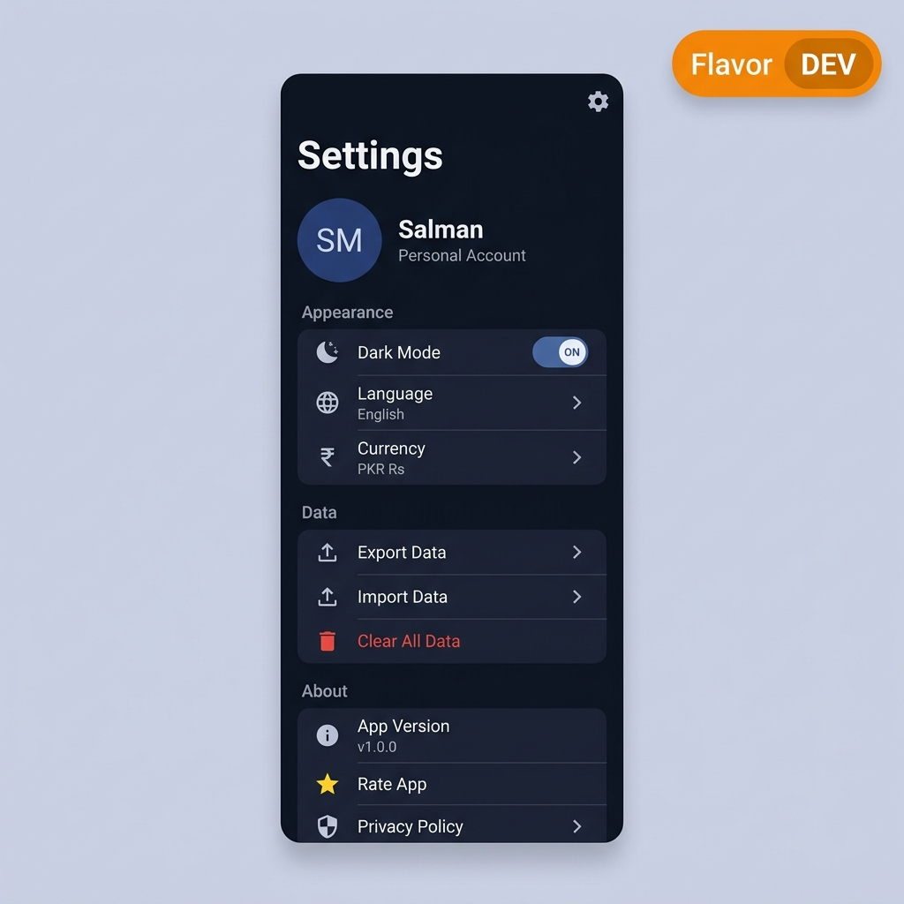

# 💸 Personal Expense App

<p align="center">
  
  
  
  
</p>

<p align="center">
  <b>A platform-adaptive, feature-rich personal finance manager built with Flutter.</b><br/>
  Material 3 on Android · Cupertino on iOS · Offline-first · Multi-flavor CI/CD ready
</p>

<p align="center">
  
  
  
  
  
  
</p>

---

## 📱 Screenshots

| Dashboard | Analytics | Add Transaction | Settings |
|:---------:|:---------:|:---------------:|:--------:|
|  |  |  |  |

---

## ✨ Features

- **📊 Dashboard** — Real-time total balance, income vs expense summary cards, recent transaction list
- **📈 Analytics** — Donut chart by category, monthly bar chart trends powered by `fl_chart`
- **➕ Add Transaction** — Expense/Income toggle, category chips, date picker, account selector
- **⚙️ Settings** — Dark/light mode, currency selector, language, export/import data, clear data
- **🎨 Platform-Adaptive UI** — Material 3 on Android, Cupertino on iOS — automatically detected at runtime
- **🌗 Dynamic Color** — Follows your Android 12+ wallpaper color palette via `dynamic_color`
- **🗄️ Offline-First** — All data stored locally using ObjectBox (no backend required)
- **📤 Export / Import** — Backup and restore your data
- **🌍 Localization** — Multi-language ready via Flutter's `intl` + ARB files
- **🔀 Multi-Flavor Builds** — `dev`, `stage`, `prod` flavors with separate bundle IDs and API endpoints

---

## 🏗️ Architecture

This project follows **Clean Architecture** with a strict separation of concerns:

```
lib/
├── core/                         # Shared infrastructure
│   ├── calculation/              # Antigravity rule engine (JSON-driven)
│   ├── config/                   # AppConfig + AppFlavor (env profiles)
│   ├── di/                       # GetIt service locator bindings
│   ├── l10n/                     # ARB localization files
│   ├── objectbox/                # ObjectBox store initialization
│   ├── services/                 # ExportImport, VersionCheck services
│   ├── theme/                    # AppTheme (Material 3 + Cupertino tokens)
│   ├── utils/                    # Date formatters, currency helpers
│   └── widgets/                  # AdaptiveScaffold, AdaptiveButton, etc.
│
├── features/
│   ├── finance/                  # Core finance feature
│   │   ├── data/
│   │   │   ├── models/           # Transaction, BankAccount (ObjectBox entities)
│   │   │   └── repositories/     # FinanceRepository (ObjectBox impl)
│   │   ├── domain/
│   │   │   └── repositories/     # FinanceRepository interface
│   │   └── presentation/
│   │       ├── bloc/             # FinanceBloc (events + states)
│   │       ├── screens/          # Dashboard, Analytics, AddTransaction
│   │       └── widgets/          # DashboardHomeView, TransactionCard, etc.
│   │
│   └── settings/                 # Settings feature (same layer structure)
│
├── main.dart                     # Production entry-point
├── main_dev.dart                 # Development entry-point
├── main_stage.dart               # Staging entry-point
└── personal_expense_app.dart     # Root widget (MaterialApp / CupertinoApp)
```

---

## 🔧 Tech Stack

| Layer | Technology |
|-------|-----------|
| **Framework** | Flutter 3.x (Dart 3.11) |
| **State Management** | flutter_bloc 8.x + BLoC pattern |
| **Dependency Injection** | get_it 7.x |
| **Local Database** | ObjectBox 2.5 (native, zero-cost) |
| **Charts** | fl_chart 0.66 |
| **Typography** | Google Fonts (Inter) |
| **Dynamic Theming** | dynamic_color 1.8 (Material You) |
| **Localization** | flutter_localizations + intl 0.20 |
| **Platform Detect** | `dart:io` Platform + Adaptive Widget wrappers |
| **Testing** | flutter_test + BLoC test |

---

## 🚀 Flavors (Build Environments)

Three fully isolated environments, each installable simultaneously on the same device:

| Flavor | Bundle ID | App Name | Entry-point | API Base |
|--------|-----------|----------|-------------|----------|
| **dev** | `...app.dev` | Personal Expense (Dev) | `lib/main_dev.dart` | `https://dev.api.personalexpense.app` |
| **stage** | `...app.stage` | Personal Expense (Stage) | `lib/main_stage.dart` | `https://stage.api.personalexpense.app` |
| **prod** | `...app` | Personal Expense | `lib/main.dart` | `https://api.personalexpense.app` |

### Android flavor configuration
Defined in [`android/app/build.gradle.kts`](android/app/build.gradle.kts) via `productFlavors`.

### iOS flavor configuration
Defined via 6 xcconfig files in [`ios/Flutter/`](ios/Flutter/) and 3 Xcode schemes in [`ios/Runner.xcodeproj/xcshareddata/xcschemes/`](ios/Runner.xcodeproj/xcshareddata/xcschemes/).

---

## 🖥️ Running the App

### Prerequisites

- Flutter SDK via [FVM](https://fvm.app/) (see `.fvm/fvm_config.json`)
- Android Studio / Xcode installed
- Physical device or emulator

### Install dependencies

```bash
fvm flutter pub get
```

### Run a flavor

```bash
# Development
fvm flutter run --flavor dev -t lib/main_dev.dart

# Staging
fvm flutter run --flavor stage -t lib/main_stage.dart

# Production
fvm flutter run --flavor prod -t lib/main.dart
```

### VS Code (press F5)

Launch configs are pre-configured in [`.vscode/launch.json`](.vscode/launch.json).
Press **F5** and pick from the dropdown:

| Config | Description |
|--------|-------------|
| 🚧 Dev (Android) | Dev flavor on Android |
| 🚧 Dev (iOS) | Dev flavor on iOS |
| 🧪 Stage (Android/iOS) | Staging flavor |
| 🚀 Prod (Android/iOS) | Production flavor |
| 🚀 Prod — Release | Production release build |

### Build APK / IPA

```bash
# Android APK (prod)
fvm flutter build apk --flavor prod -t lib/main.dart

# Android App Bundle (prod)
fvm flutter build appbundle --flavor prod -t lib/main.dart

# iOS IPA (prod)
fvm flutter build ipa --flavor prod -t lib/main.dart
```

---

## 🧪 Testing

```bash
# Run all tests
fvm flutter test

# Run with coverage
fvm flutter test --coverage

# Static analysis
fvm flutter analyze
```

**Test coverage:**
- `AdaptiveScaffold` widget tests — renders correct native scaffold per platform
- `DashboardScreen` widget tests — validates BLoC state rendering on Android
- All tests use interface-based fakes (no ObjectBox or native dependencies)

---

## 📂 Project Structure (full)

```
expense_manager_app/
├── android/                    # Android native project
│   └── app/
│       ├── build.gradle.kts    # Product flavors (dev/stage/prod)
│       └── src/
│           ├── main/AndroidManifest.xml
│           ├── dev/            # Dev flavor resources
│           ├── stage/          # Stage flavor resources
│           └── prod/           # Prod flavor resources
├── ios/                        # iOS native project
│   ├── Flutter/
│   │   ├── Debug-dev.xcconfig
│   │   ├── Debug-stage.xcconfig
│   │   ├── Debug-prod.xcconfig
│   │   ├── Release-dev.xcconfig
│   │   ├── Release-stage.xcconfig
│   │   └── Release-prod.xcconfig
│   └── Runner.xcodeproj/
│       └── xcshareddata/xcschemes/
│           ├── dev.xcscheme
│           ├── stage.xcscheme
│           └── prod.xcscheme
├── assets/
│   ├── config/
│   │   └── antigravity_rules.json   # JSON-driven calculation rule engine
│   └── screenshots/                 # App preview images
├── lib/                             # Dart source (see Architecture above)
├── test/                            # Unit + widget tests
├── .vscode/
│   ├── launch.json                  # F5 flavor launch configs
│   └── settings.json                # FVM SDK path
└── pubspec.yaml
```

---

## ⚙️ Calculation Rule Engine

The app uses a **JSON-driven rule engine** (`assets/config/antigravity_rules.json`) to calculate balances, categorize transactions, and apply financial strategies — no hardcoded business logic in Dart.

Rules are loaded at boot by the `Bootstrapper` and registered into `GetIt` as a service, making them hot-swappable per flavor or remote-config update.

---

## 🌐 Localization

ARB files live in `lib/core/l10n/`. To add a new language:

1. Create `app_XX.arb` (e.g. `app_ur.arb` for Urdu)
2. Add the locale to `personal_expense_app.dart`
3. Run `fvm flutter gen-l10n`

---

## 📋 Known Warnings

> **Kotlin Gradle Plugin (KGP)** — Some dependencies (`dynamic_color`, `objectbox_flutter_libs`, `package_info_plus`, `url_launcher_android`) currently apply KGP directly. This will fail in a future Flutter version. Upgrade these packages when newer KGP-compliant versions are released.

---

## 📄 License

This project is private and not published to pub.dev (`publish_to: none`).

---

<p align="center">Built with ❤️ using Flutter · Clean Architecture · BLoC · ObjectBox</p>
